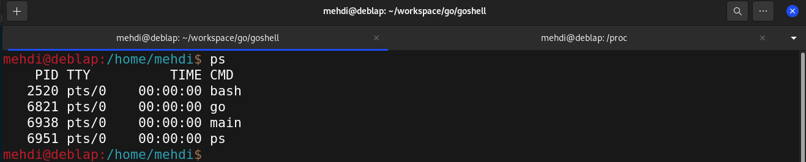

# goshell
A shell for Unix like operating systems.

### Features
* Concurrent and Synchronized process execution
* Output redirection (input, output)
* Piping
* CD command
* Neat UI

### To do
* Support for history navigation using arrow keys
* Support for left and right traversing using arrow keys
